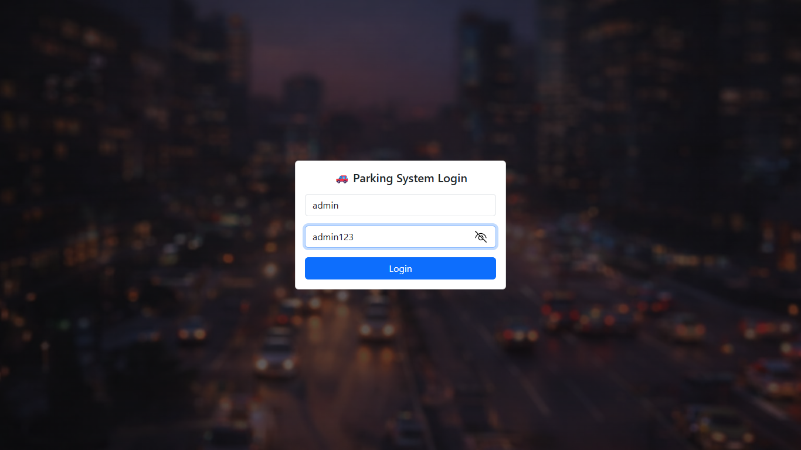
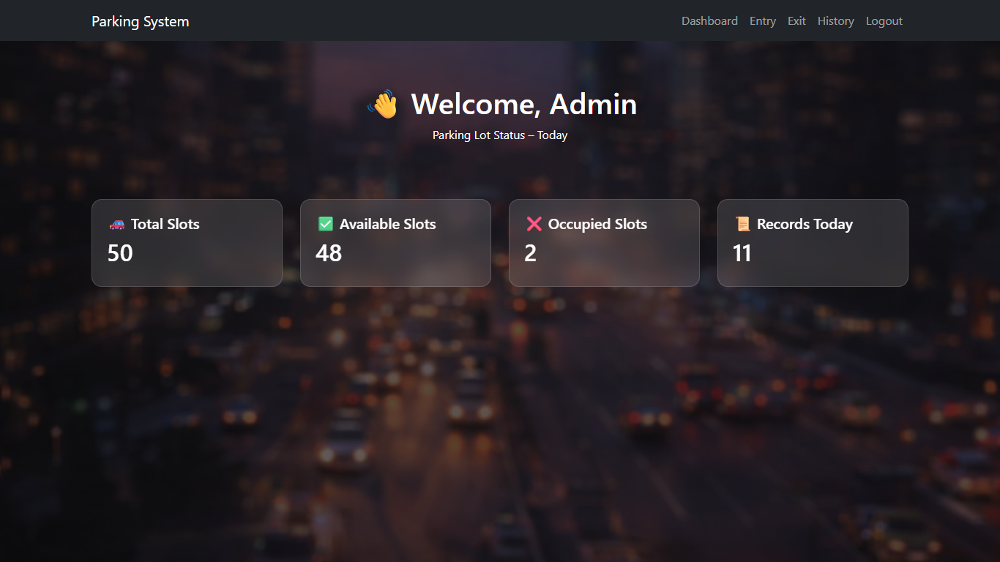
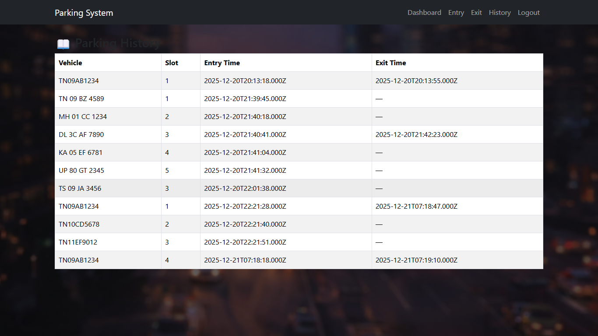

# 🚗 Parking Lot Management System

A full-stack web application to manage vehicle entry, exit, parking slot allocation, and daily parking statistics.

Built using **React.js**, **Node.js**, **Express**, and **MySQL** with **JWT authentication**.

---

## 🌍 Live Demo

🔗 Frontend Demo (Netlify):  
https://parking-lot-management-demo.netlify.app/

🧪 Demo Credentials:
- Username: admin
- Password: admin123

⚠️ Note:  
This is a frontend-only demo version.  
Backend (Node.js + MySQL) runs locally.

---

## 🔥 Features

- 🔐 Secure login using JWT authentication
- 🚙 Vehicle entry with automatic slot allocation
- 🚪 Vehicle exit with slot release
- 📊 Real-time dashboard showing parking statistics
- 📜 Parking history with timestamps
- 🧩 Role-based access (Admin)
- 🎨 Clean, responsive UI using Bootstrap

---

## 🛠 Tech Stack

### Frontend
- React.js
- React Router
- Axios
- Bootstrap & React-Bootstrap

### Backend
- Node.js
- Express.js
- JWT Authentication
- bcryptjs (password hashing)

### Database
- MySQL

---

## 📂 Project Structure

parking-lot-management-system/  
│                             
├── backend/                  
│ ├── routes/                 
│ ├── middleware/             
│ ├── db.js                   
│ └── server.js               
│                             
├── frontend/                 
│ ├── src/                    
│ ├── public/                 
│                             
├── screenshots/              
│ ├── login.png               
│ ├── dashboard.png           
│ └── history.png             
│                             
└── README.md                 
                              
---

## 📸 Screenshots

### 🔐 Login Page


### 📊 Dashboard


### 📜 Parking History


---

## 🗄 Database Overview

- **users** – stores admin login credentials and roles
- **parking_slots** – manages parking slot availability (total slots = 50)
- **parking_records** – stores vehicle entry and exit history with timestamps

---

## ⚙️ Setup Instructions

### 1️⃣ Clone Repository

```bash
git clone https://github.com/thiruharikaran/parking-lot-management-system.git
cd parking-lot-management-system
```
---

### 2️⃣ Backend Setup

```bash
cd backend
npm install
node server.js
```

Backend runs at:

http://localhost:5000

---

### 3️⃣ Frontend Setup

```bash
cd frontend
npm install
npm start
```

Frontend runs at:

http://localhost:3000

---

---

## 🚀 Future Enhancements

- Multiple user roles (Security / Admin)
- Parking slot visualization grid
- Parking fee calculation
- Backend deployment using cloud services

---

## 👨‍💻 Author

**Thiruharikaran R**  
B.Tech Information Technology  
SRM Easwari Engineering College  

GitHub: https://github.com/thiruharikaran
